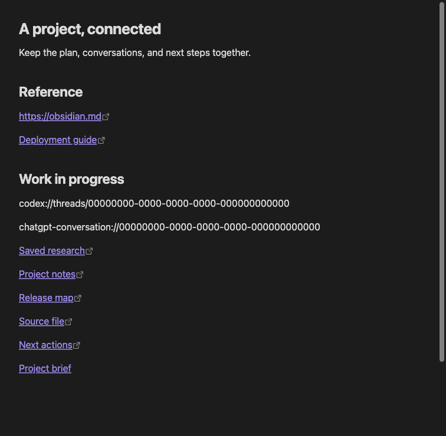
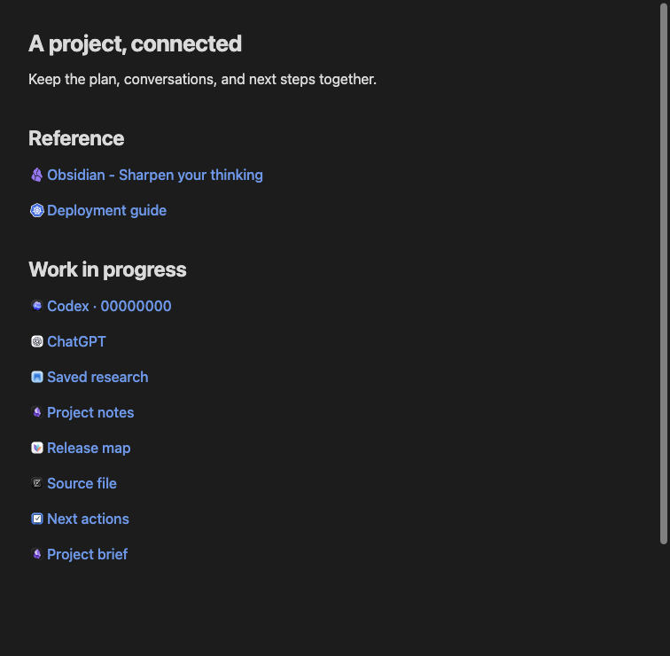
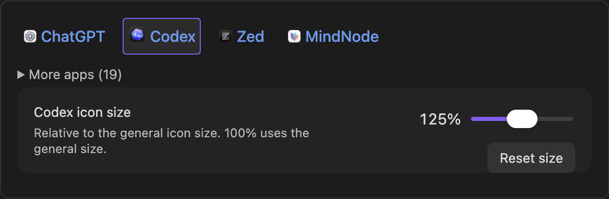

# Link Flair

Compact icons and readable labels for web links, app deep links, and native Obsidian links. Works in Reading view and Live Preview while preserving your Markdown.

| Without Link Flair | With Link Flair |
| --- | --- |
|  |  |

Both screenshots show the same synthetic Markdown note in Obsidian. The plugin changes its presentation, not its source.

## Features

- Cached website icons and page titles for bare web URLs, with useful fallbacks.
- Bundled icons for 23 supported apps, including ChatGPT, Codex, OmniFocus, DEVONthink, Drafts, Bear, Visual Studio Code, Cursor, Hookmark, and nine JetBrains IDEs; generic icons for other app links.
- Native note links retain aliases, backlinks, navigation, and hover previews.
- Explicit Markdown labels keep their text and formatting. Source mode stays unchanged.
- Live appearance controls for colors, text weight, and icon size, spacing, opacity, brightness, and saturation.
- Commands to copy destinations or Markdown links, show a URL, use a page title as link text, and clear cached metadata. Commands that change text are explicit, undoable edits.

## Installation and compatibility

Requires **Obsidian 1.13.7 or later**. Link Flair is being prepared for its first Community plugins submission and is not yet listed in the directory.

For a published release, download `main.js`, `manifest.json`, and `styles.css` from the same [GitHub release](https://github.com/igorhajduk/obsidian-link-flair/releases). Put them in `<vault>/.obsidian/plugins/link-flair/`, reload Obsidian, and enable **Link Flair** under **Settings → Community plugins**. Installation does not require Node.js or the source repository.

To install a local build:

1. Run `npm ci` and `npm run package` in this repository (Node.js 22.13 or later).
2. Copy `dist/link-flair` into your vault's `.obsidian/plugins/` directory.
3. Reload Obsidian and enable **Link Flair** under **Settings → Community plugins**.

Tested on macOS, iPhone, and iPad. macOS testing used Obsidian 1.13.7; iPhone testing used Obsidian 1.13.7 (365). Windows and Linux UI testing is pending. Linux CI runs automated tests and build checks.

## Usage

Open links normally in Reading view. In Live Preview, selecting a compact URL reveals its source for editing; desktop modifier-click opens its destination. Authored and internal links retain Obsidian's native interactions. An app link requires its destination app and URI handler to be available on that device.

Open **Settings → Link Flair** to change appearance and link behavior. Use **Use theme link colors** to follow your theme, or choose your own normal and hover colors for light and dark mode. **Underline links on hover** optionally adds a dashed underline; it is off by default, so hovering only changes the link color. **Reset appearance** restores appearance defaults without changing link behavior or cached metadata.

The appearance preview initially shows ChatGPT, Codex, Zed, and MindNode. Expand **More apps** to see the other supported apps. Select a supported app in the preview to adjust only its icon size (50–200% of the general icon size). **Reset size** restores that app to 100%; **Reset appearance** also clears all individual app sizes. Website favicons continue to use the general size. Brightness, saturation, and opacity remain adjustable for all icons, with original colors at their defaults.

See [supported apps and URL schemes](docs/supported-apps.md) for the full list. Destinations are preserved exactly. App item metadata is not retrieved; use `[Your label](app://…)` for a specific title.

## Network and privacy

**Remote web metadata is enabled by default.** Link Flair requests titles and favicons directly from linked websites using Obsidian's request API. Websites receive the requested URLs. No analytics, account, plugin backend, or third-party favicon service is used. App URIs, internal links, and bundled app icons do not require network requests.

Turn off **Remote web metadata** to stop new requests. Already-sent requests cannot be cancelled. Derived metadata is stored with plugin settings in `data.json`; your sync configuration may carry that data. Notes do not depend on this cache. See [network behavior and limits](docs/design.md#metadata-and-network-behavior).

## Documentation and development

- [Contributing](CONTRIBUTING.md): setup, commands, pull requests, and releases.
- [Testing](docs/testing.md): automated checks and desktop/mobile acceptance.
- [Design](docs/design.md): architecture, behavior, and limitations.
- [Application artwork](docs/app-icons.md): sources, distribution status, and updating images.
- [Changelog](CHANGELOG.md): version history.

Source code is licensed under [MIT](LICENSE). Third-party application icons and trademarks are excluded from that license and belong to their respective owners. They identify link destinations; Link Flair is not affiliated with or endorsed by those owners. See [artwork sources and usage information](docs/app-icons.md).
